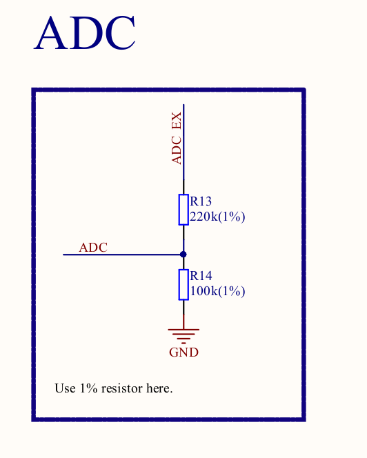

ESP8266 has one 10-bit SAR ADC connected to the pin 6 (TOUT). We can implement two measurements using this ADC:
	1. Measure the power supply voltage of the VDD3P3 pint
	2. Measure the input voltage from the TOUT (pin 6)
	
We can't have this two measurements at the same time.

**Important: When we are measuring external power supply, maximum input voltage on the pin TOUT can't exceed 1V**

Because of this, on the Node MCU development board we have voltage divider connected to the pin TOUT. In this case we can then measure voltage up to 3.3 V

